# FieldSignal

**Authenticated environmental observations, validator-retrieved evidence, and accountable field response on GenLayer StudioNet.**

[Live application](https://abstrusimad.github.io/fieldsignal/) | [StudioNet contract](https://explorer-studio.genlayer.com/address/0x62a1532a70d696199BbDC8C4C2c45b338090A38a) | [Deployment transaction](https://explorer-studio.genlayer.com/tx/0x5a6ce08d3010d95472dcb19cfcd75cf093fe581f1b7c4b9e2e6dbf56e746bb8e) | [Contract source](./contracts/fieldsignal.py)

FieldSignal is a public operational protocol for turning physical sensor readings into evidence-bound incidents. It does not ask validators to judge an unverified URL or accept an arbitrary wallet as a field operator. Every reading is tied to an authorized on-chain operator, every inspection is assigned to a registered inspector, and every consensus run retrieves the linked HTTPS evidence from inside the intelligent contract before changing durable state.

## Why FieldSignal Exists

Environmental systems frequently separate measurements, calibration records, response instructions, and inspection findings. That separation makes it difficult to establish who submitted a reading, what public evidence validators actually inspected, and whether the required response was completed.

FieldSignal combines those questions into one auditable lifecycle:

1. An owner maintains operator and inspector role registries.
2. An authorized station operator submits a contextual sensor observation.
3. GenLayer validators retrieve the public evidence and independently assess it.
4. Consensus records an evidence digest, verdict, severity, and canonical response code.
5. Material incidents receive an immutable required response.
6. An authorized operator assigns the incident to a registered inspector.
7. Only that recorded inspector can submit findings.
8. Validators retrieve the inspection evidence and decide whether every required action is proven.
9. The incident closes only when verified evidence supports the response completion.

## Review Remediation

This release directly addresses the requested GenLayer review controls.

| Review requirement | Contract enforcement |
| --- | --- |
| Bind readings to authenticated sensors or authorized operators | `submit_signal` checks the sensor's station and requires its operator or an active operator-registry account; the sender is persisted as `reporter`. |
| Verify linked evidence contract-side | Both consensus methods call `gl.nondet.web.render`, hash the retrieved content with SHA-256, and persist `evidence_digest` plus `evidence_verified`. |
| Enforce the recorded inspector role | Assignment requires an authorized operator and a registered inspector. Submission requires both the exact recorded assignee and an inspector role that remains active. |
| Validate the response entering incident state | Signal validators must agree on `response_code`; the contract maps it to canonical response text stored in the incident. |
| Check completion of the required response | Inspection validators independently agree on `required_response_met`; the boolean and assessment are persisted in both inspection and incident state. |
| Avoid unsupported Snap methods | Wallet connection uses standard EIP-1193 account access and never calls `client.connect`, `wallet_getSnaps`, or `wallet_requestSnaps`. |

## Consensus Boundary

```mermaid
flowchart LR
    O[Authorized operator] --> S[Submit sensor reading]
    S --> W[Contract retrieves HTTPS evidence]
    W --> V[Independent validator assessment]
    V --> D[Evidence digest + verdict + response code]
    D -->|Material event| I[Incident with canonical required response]
    I --> A[Operator assigns registered inspector]
    A --> F[Recorded inspector files findings]
    F --> R[Contract retrieves inspection evidence]
    R --> C[Validators check response completion]
    C -->|All actions proven| X[Incident closed]
    C -->|Missing actions| Y[Action required]
```



The frontend owns navigation, wallet persistence, forms, transaction progress, and readable protocol state. The intelligent contract owns roles, authorization, evidence retrieval, consensus, digests, incident creation, sensor trust, required responses, and closure rules. Public sources own the raw evidence but are never treated as trusted until validators retrieve them.

## Contract Model

### Roles

- **Owner:** activates or revokes operator and inspector accounts.
- **Operator:** enrolls sensors, files readings, and dispatches inspections.
- **Inspector:** submits findings only for an inspection explicitly assigned to that account.
- **Validator:** retrieves evidence and determines the state transition through GenLayer consensus.

Role revocation is enforced at action time. A previously assigned inspector cannot submit after losing the inspector role.

### Evidence Integrity

The URL is not the evidence result. During consensus the contract retrieves the page text, computes a SHA-256 digest, and supplies the retrieved content to the assessment prompt. A resolved record exposes:

- `evidence_url`
- `evidence_digest`
- `evidence_verified`
- the validator analysis and bounded decision fields

Unreachable evidence produces `INVALID_EVIDENCE`, cannot open an incident, and leaves no false verification marker.

### Canonical Responses

Validators choose a response code compatible with the verdict:

| Code | Operational meaning |
| --- | --- |
| `LOG_ONLY` | Retain routine cadence and preserve the verified record. |
| `INCREASE_MONITORING` | Increase sampling and publish a follow-up comparison. |
| `DISPATCH_INSPECTION` | Send an authorized inspector and collect reference evidence. |
| `ISOLATE_SENSOR` | Quarantine the instrument until verified recalibration. |
| `EVIDENCE_REQUIRED` | Replace an unreachable source before operational action. |

The contract converts the agreed code into canonical text. This prevents an unchecked leader-generated instruction from silently becoming incident state.

## Public Interface

| Family | Write methods | Read methods |
| --- | --- | --- |
| Authorization | `set_operator`, `set_inspector`, `set_station_operator` | `get_roles`, `get_overview` |
| Instrument registry | `enroll_sensor` | `get_stations`, `get_sensors` |
| Observation consensus | `submit_signal`, `resolve_signal` | `get_signals`, `get_incidents` |
| Response operations | `assign_inspection`, `submit_inspection`, `resolve_inspection` | `get_inspections` |

## StudioNet Deployment

| Property | Value |
| --- | --- |
| Network | GenLayer StudioNet |
| Chain ID | `61999` |
| Contract | `0x62a1532a70d696199BbDC8C4C2c45b338090A38a` |
| Deployment transaction | `0x5a6ce08d3010d95472dcb19cfcd75cf093fe581f1b7c4b9e2e6dbf56e746bb8e` |
| Deployer | Account 0, `0x95803126315A05E642D8E46CE1d77eA2199a2A6E` |
| Explorer | `https://explorer-studio.genlayer.com` |

Deployment metadata records the source hash, deployment transaction, deployer, network, remediation flags, and every accepted seed transaction. `verify:studionet` independently reads the deployed collections and checks evidence and response invariants.

## Development

Requirements:

- Node.js 22+
- pnpm 9.15.5
- Python 3.11+
- `genlayer-test` and `genvm-lint`

```bash
corepack pnpm install
corepack pnpm --dir app install
python -m pytest tests/direct/test_fieldsignal.py -q
genvm-lint check contracts/fieldsignal.py
corepack pnpm --dir app run build
```

StudioNet operations use `GENLAYER_PRIVATE_KEY_0` from the workspace `.env`. The private key is never read by the frontend, deployment metadata, build output, or repository history.

```bash
corepack pnpm run deploy:studionet
corepack pnpm run seed:studionet
corepack pnpm run verify:studionet
```

## Verification Coverage

The direct suite covers:

- Genesis role registration
- Owner-only role administration
- Unauthorized reading rejection
- Authorized reporter persistence
- Contract-side evidence retrieval and SHA-256 storage
- Unreachable evidence rejection
- Prevention of permissionless inspection self-assignment
- Recorded-assignee enforcement
- Inspector revocation after assignment
- Required-response completion persisted in incident state
- `ACTION_REQUIRED` when material response actions are unproven

Direct mode executes the leader path quickly; the StudioNet seed and verification scripts exercise live validator consensus and deployed state.

## Repository Map

```text
contracts/fieldsignal.py          Intelligent contract and protocol invariants
tests/direct/test_fieldsignal.py  Authorization, evidence, and lifecycle tests
docs/evidence/                    Public records retrieved by StudioNet validators
scripts/deploy-studionet.mjs      Account 0 deployment and source manifest
scripts/seed-studionet.mjs        Real authenticated observations and inspections
scripts/verify-studionet.mjs      Live-state invariant verification
app/src/                          Vue field-kit interface and wallet integration
deployments/                      Public deployment and accepted transaction records
```

## Security Notes

- HTTPS is required but never considered sufficient on its own.
- Evidence is retrieved inside consensus and bound to state by digest.
- Response codes are constrained by verdict compatibility.
- Inspection assignment cannot be claimed by an arbitrary wallet.
- Inspector authorization is checked both at assignment and submission.
- Incident closure requires verified evidence and a consensus-confirmed completed response.
- The StudioNet release is an advanced test deployment, not a certified environmental monitoring service.

## License

FieldSignal is released under the [MIT License](./LICENSE).
