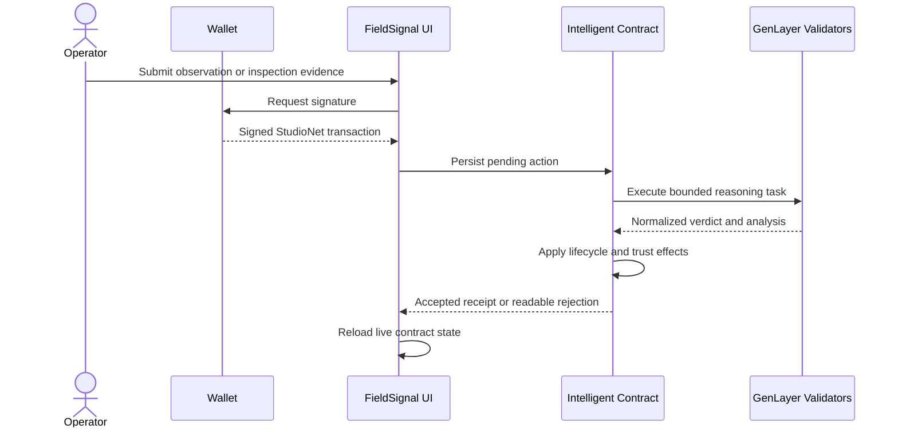

# FieldSignal

> **Field note 01:** a sensor reading is a claim about the physical world.
> FieldSignal makes that claim survive calibration checks, public evidence, validator reasoning, and accountable response before it becomes an incident.

[Open the live decision field](https://abstrusimad.github.io/fieldsignal/) | [Inspect the StudioNet contract](https://explorer-studio.genlayer.com/address/0x66127559067cB46dA87E974fb598ba0a44fBA75C) | [Review the deployment transaction](https://explorer-studio.genlayer.com/tx/0xf9b20fdbba84dbf783c4b396c14ebfd5636ab113f7fb866eb7ef7ee26728381c)

## 00 / The observation problem

Environmental operations often fail at the boundary between measurement and interpretation. A reading can be numerically unusual while still being harmless, or look ordinary while neighboring activity, maintenance history, and field evidence indicate a real event. Conventional alert systems usually separate those facts and leave a human operator to reconcile them after the alarm has already propagated.

FieldSignal is a GenLayer-native integrity and response protocol for that boundary. It keeps stations, instruments, contextual readings, validator conclusions, incidents, and inspections in one durable lifecycle. GenLayer intelligence is not used as a detached answer service: validator output changes sensor trust, opens incidents, quarantines instruments, assigns response work, and determines how inspection evidence affects protocol state.

## 01 / Live plate

The public deployment is populated with real StudioNet records. The frontend reads this contract directly and does not ship a mocked protocol dataset.

| Coordinate | Live value |
| --- | ---: |
| Network | GenLayer StudioNet |
| Contract | `0x66127559067cB46dA87E974fb598ba0a44fBA75C` |
| Deployment transaction | `0xf9b20fdbba84dbf783c4b396c14ebfd5636ab113f7fb866eb7ef7ee26728381c` |
| Monitoring stations | 6 |
| Registered sensors | 8 |
| Submitted signals | 3 |
| Durable incidents | 2 |
| Field inspections | 1 |
| Seed activity transactions | 8 accepted |

The deployed field covers air quality, soil moisture, dissolved oxygen, wet-bulb temperature, water level, wind speed, and turbidity across industrial, agricultural, coastal, residential, wetland, and upland contexts.

## 02 / How a claim moves

```text
PHYSICAL OBSERVATION
  value + timestamp + context + HTTPS evidence
                |
                v
SIGNAL RECORD  [PENDING]
                |
                v
GENLAYER VALIDATOR CORRELATION
  station + region + metric + baseline + sensor trust
  + calibration source + observation + public evidence
                |
      +---------+----------+-----------+
      |         |          |           |
    NORMAL    WATCH     INCIDENT   QUARANTINE
      |         |          |           |
 trust +2    durable    open route   trust -20
                         |            sensor held
                         v
                 FIELD INSPECTION
            plan -> findings -> evidence
                         |
                         v
             SECOND VALIDATOR DECISION
       CONFIRMED / FALSE_ALARM / RECALIBRATE / ESCALATE
```

The first consensus decides what the observation means. The second decides what the physical inspection proves. Both decisions are normalized to bounded enums before any storage mutation occurs.

## 03 / Intelligence under constraint

### Signal correlation

Validators receive the station identity and region, the sensor metric and unit, its baseline band and trust score, the submitted value and timestamp, environmental context, calibration source, and public evidence URL.

The accepted output is restricted to:

| Verdict | Durable effect |
| --- | --- |
| `NORMAL` | Resolves the signal and increases sensor trust, capped at 100 |
| `WATCH` | Resolves and preserves the observation for continued monitoring |
| `INCIDENT` | Opens a durable response record with severity and instructions |
| `QUARANTINE` | Opens an incident, reduces trust, and removes the sensor from active status |

Each result also persists bounded severity, bounded confidence, analysis, and a specific response instruction. Invalid shapes, unsupported verdicts, and out-of-range values fail validation instead of entering storage.

### Inspection review

After an incident receives a field plan, the assignee publishes findings and an HTTPS evidence source. A second validator task compares those findings with the original incident and required response.

| Verdict | Durable effect |
| --- | --- |
| `CONFIRMED` | Resolves the inspection and closes the incident |
| `FALSE_ALARM` | Closes the incident and adjusts the sensor trust record |
| `RECALIBRATE` | Marks the sensor as calibration due and keeps action visible |
| `ESCALATE` | Leaves the incident in an action-required state |

This two-decision design prevents a plausible initial anomaly from becoming an unquestioned final truth.

## 04 / Contract field catalogue

The Intelligent Contract is implemented in [`contracts/fieldsignal.py`](contracts/fieldsignal.py) and stores five linked record families.

| Record | Important state |
| --- | --- |
| `Station` | region, operator, sensor count, station trust |
| `Sensor` | metric, unit, baseline, calibration source, status, trust, signal count |
| `Signal` | observation, context, evidence, verdict, severity, confidence, response |
| `Incident` | source signal, station, severity, lifecycle status, inspection link |
| `Inspection` | assignee, plan, findings, evidence, verdict, analysis |

### Public writes

| Method | Purpose | Important boundary |
| --- | --- | --- |
| `enroll_sensor` | Register a calibrated instrument at an existing station | Existing station, bounded fields, HTTPS calibration URL |
| `submit_signal` | Persist a contextual physical-world observation | Existing sensor, 60-1200 character context, HTTPS evidence |
| `resolve_signal` | Run validator correlation and mutate operational state | Signal must still be `PENDING` |
| `assign_inspection` | Attach a field plan and assignee to an incident | Incident exists and has no inspection |
| `submit_inspection` | Publish field findings and evidence | Assigned inspection, 100-1800 character findings |
| `resolve_inspection` | Run validator review of the field evidence | Inspection must be ready for review |

### Public views

`get_overview`, `get_stations`, `get_sensors`, `get_signals`, `get_incidents`, and `get_inspections` expose JSON-safe records used by the live interface.

## 05 / Operator surface

The interface treats environmental integrity as a decision field rather than a generic dashboard.

- **Wallet gate:** the disconnected landing establishes the wallet as an operator origin. A previous connection is restored silently after refresh when the wallet still exposes the authorized account.
- **Decision field:** live sensors are plotted across calibration trust and corroboration dimensions. Selecting a point reveals its station, baseline, trust, signal history, and calibration source.
- **Signal traces:** submitted observations appear as examination traces with value, time, context, evidence, validator analysis, confidence, and verdict.
- **Response plan:** incidents and inspections form linked operational routes rather than unrelated cards.
- **Write sheets:** signal and inspection submissions enforce the same input boundaries as the contract before asking for a wallet signature.
- **Execution trace:** every write exposes signature, validator consensus, acceptance, and human-readable failure states.

On mobile, the decision surface becomes a square focused chart, the active annotation moves below it, trace records recompose into readable sheets, and response routes retain their lifecycle order.

## 06 / Transaction trace



The client retries transient StudioNet saturation responses with bounded backoff. Contract rejections are decoded from GenVM receipts so the interface does not collapse failures into `[object Object]`.

## 07 / Run the instrument

### Requirements

- Node.js 20 or newer
- pnpm 9
- A browser wallet compatible with GenLayer StudioNet
- Python and GenLayer tooling for contract verification

### Frontend

```bash
cd app
pnpm install
pnpm run dev
```

Production build:

```bash
cd app
pnpm run build
```

### Environment reference

No secret belongs in the browser bundle.

| Variable | Scope | Secret |
| --- | --- | --- |
| `VITE_CONTRACT_ADDRESS` | Frontend public deployment address | No |
| `VITE_EXPLORER_URL` | Frontend public explorer base URL | No |
| `GENLAYER_PRIVATE_KEY_0` | Local deployment and seeding only | **Yes** |

Deployment scripts read `GENLAYER_PRIVATE_KEY_0` from the ignored Season 3 `.env`. Never place it in `app/.env`, committed JSON, screenshots, logs, or GitHub Actions output.

## 08 / Verify before trusting

Contract lint:

```bash
genvm-lint check contracts/fieldsignal.py
```

Focused direct tests:

```bash
python -m pytest tests/direct -q
```

Frontend production build:

```bash
cd app
pnpm run build
```

The browser verification pass covers the disconnected wallet gate, persistent re-entry, all six StudioNet reads, the three operational views, write forms, transaction lifecycle placement, full-width desktop rendering, and mobile overflow.

## 09 / Deploy and seed

From the repository root:

```bash
pnpm install
pnpm run deploy
pnpm run seed
```

The deployment script writes public metadata to `deployments/studionet.json` and public frontend values to `app/.env.production`. The seeding script creates accepted StudioNet activity for the interface's core states. Neither file contains the private key.

## 10 / Repository bearings

```text
fieldsignal/
|-- app/                       Vue interface and StudioNet client
|   |-- src/App.vue            Wallet gate and operational surfaces
|   |-- src/services/          GenLayer reads, writes, retries, receipt errors
|   `-- .env.production        Public contract and explorer values
|-- contracts/fieldsignal.py   Intelligent Contract
|-- deployments/               Public deployment and activity receipts
|-- scripts/                   StudioNet deployment and seeding
|-- tests/direct/              Direct-mode contract tests
`-- README.md                  This field notebook
```

## 11 / Security perimeter

- Private keys remain outside the repository and are consumed only by local scripts.
- User input is bounded before validator execution.
- Calibration and evidence sources must use HTTPS.
- Lifecycle guards prevent duplicate resolution and duplicate inspection assignment.
- Validator results are schema-checked and enum-restricted before state mutation.
- Trust and score updates are clamped to valid ranges.
- The frontend displays public addresses and transaction hashes only.

## 12 / Public coordinates

- **Live application:** https://abstrusimad.github.io/fieldsignal/
- **Repository:** https://github.com/AbstrusImad/fieldsignal
- **Publishing account:** [@AbstrusImad](https://github.com/AbstrusImad)
- **StudioNet explorer:** https://explorer-studio.genlayer.com
- **Contract:** `0x66127559067cB46dA87E974fb598ba0a44fBA75C`

---

FieldSignal is released under the MIT License. The contract is public, the evidence trail is inspectable, and the final authority remains the state transition accepted by GenLayer validators.
